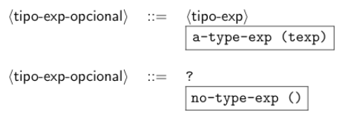

# Clase 10 Inferencia de Tipos

- Algunos lenguajes dejan que el compilador infiera el tipo de las variables
- Esto hace que según sean usadas las variables ayuden al programador con aportes, esto es conocido como “inferencia de tipos”

> Para el lenguaje a hacer, las expresiones de tipo son opcionales y donde no hayan tipos se pondrá “?”
> 

Ejemplo:

```racket
letrec
	? even(? odd, int x) = 
			if zero?(x) then 1 else (odd sub1(x))
	in letrec
		bool odd(? x)
			if zero?(x) then 0 else (even odd sub1(x))
		in (odd 13)		
```

Donde los 3 símbolos de “?” indican el lugar donde debe ir un tipo.

Al lenguaje se agregan nuevas reglas:



Y para poder usarse deben cambiarse las reglas de producción:


Y se deben agregar nuevas producciones:

```racket
(expression 
("proc" "(" (separated= list tipo= exp= opcional identifier ",") ")" expression) 
proc-exp) 
(expression ("letrec" (arbno tipo= exp= opcional identifier "(" (separated= list tipo= exp= opcional identifier ",") ")" "=" expression) "in" expression) letrec= exp)
```

y se agregan las producciones a las expresiones 

```racket
( tipo= exp= opcional (tipo= exp) a= type= exp) 
( tipo= exp= opcional ("?") no= type= exp)
```

Para operar con estas nuevas formas con el simbolo “?” se agrega una nueva clase de tipo llamada “variable de tipo”

Cada variable tiene un unico numero serial que lo identifica y tambien tendra un contenedor que será un vector de tamaño 1.

- Una variable de tipo puede ser vacía (que almacena ())
- Puede ser llena (almacena un tipo), y cuando esta es llena su contenido nunca cambia, a esto se le llama “asignación simple o de única escritura”

## Más cambios de código

El tipo de dato type es modificado, creando nuevas variantes:


Se crea un procedimiento fresh-tvar que crea una variable de tipo con valor único para su contenedor y su vector inicia en ():


Se deben cambiar los llamados al procedimiento expand-type-expression por expand-optional-type-expression para estar acorde con los cambios hechos en la gramatica. 

El procedimiento expand-optional-type-expression recibe una expresion de tipo opcional y un ambiente de tipos y se comporta de la siguiente manera: 

Si encuentra una expresion de tipo (la expresion corresponde a la variante a-type-exp), llama a expand-type-expression. 

Si se trata de una expresion de tipo opcional (denotada por ?), emite una variable de tipo.

El procedimiento expand-optional-type-expression estara definido asi:


Para cada expresión en el lengujae, se obtiene alguna ecuación entre tipos y variable de tipo:

ejemplo:


Esto significa que cada aplicación el operador debe ser un procedimiento que asigna los tipos de los operandos al tipo de la aplicacion entera.


- Para deducir el tipo de una expresión se intoprduce una varibale de tipo para cada variable ligda y cada aplicación y se escribe una ecuación para cada  compponente de la expresión usando las reglas anteriores

ejemplo:


Por la regla de los procedimientos, el tipo de toda la expresion tp es (tf * tx-> t1).

Por esto, se debe hallar los tipos tf, tx y t1.


La primera ecuacion muestra que el procedimiento f debe tomar un primer argumento del mismo tipo que +(1,x) y un segundo argumento del mismo tipo de zero?(x), y su resultado debe ser del mismo tipo que la aplicacion.

Las otras ecuaciones son similares: en el lado izquierdo esta el tipo del operador, y en el lado derecho el tipo construido de los tipos de los operandos y el tipo de la aplicacion. Las tres ecuaciones de tipo:


Se concluye por la segunda ecuacion que: 
tx = int 
t2 = int

Sustituyendo estos valores en la primera y tercera ecuacion se tiene:

tf = (int * t3-> t1) 
(int-> bool) = (int-> t3)

De la ultima ecuacion se deduce:
t3 = bool

Sustituyendo en la primera ecuacion: 
tf = (int * bool-> t1)

Se han resuelto todas las variables de tipo, excepto t1 y tf:

tf = (int * bool-> t1) 
tx = int 
t2 = int
t3 = bool

- Se tiene que el primer argumento del procedimiento, f, debe ser un procedimiento de dos argumentos:
    
    Elprimero debe ser un int (correspondiente a t2). 
    
    El segundo debe ser un bool (correspondiente a t3).
    

Asi mismo, el segundo argumento del procedimiento. x, debe ser un int (variable de tipo tx).

Luego, se tiene que el tipo de proc(f,x) (f +(1,x) zero?(x)) (representado por la variable de tipo tp) es ((int*bool-> t1) * int-> t1) para cualquier t1.

El codigo funcionara para cualquier tipo t1. Se dice entonces que la expresion es polimor ca en t1.


Pero no existe ningun valor para t3 que haga igual a esos tipos.

Para que fueran iguales se debera tener que int = (list int), lo cual es falso.

De alli que la expresion es rechazada y hay un error de tipos.

### Resumen de esto

la inferencia de tipos (realizada por el procedimiento check-equal-type!) toma dos tipos t1 y t2, y revisa si ellos pueden ser el mismo. Si lo son, ajusta el contenido de las variables de tipo para igualarlos.

### Procedimiento

1. Si lo son, ajusta el contenido de las variables de tipo para igualarlos.
2. Si t1 es una variable de tipo, llama al procedimiento check-tvar-equal-type! con t1 y t2, pasando exp para el reporte de error. De igual forma para t2.
3. Si t1 y t2 son tipos atomicos, determina si ellos tienen el mismo nombre; si no, no pueden ser igualados,y un error es reportado.
4. Si t1 y t2 son procedimientos de tipo, determina si tiene el mismo numero de argumentos. Si lo tienen, se llama recursivamente con cada argumento y el tipo resultado.
5. De lo contrario, t1 y t2 no pueden ser igualados, por lo que se reporta un error.

## Definición de check-equal-type!


Ejemplois:

### 1.


### Solución:

Luego, dado que f corresponde a un procedimiento, su tipo estara determinado por el tipo de sus parametros formales y de su resultado.

Por de nicion el tipo de la expresion let corresponde al tipo de su cuerpo (en este caso f).

Por esta razon se tendran las siguientes ecuaciones de tipo: 

tf = (tx-> tx) 

t1 = tf

Donde el tipo de f y del let es (tx-> tx) para cualquier tipo tx.

### 2.


### Solución:

Se tendran las siguientes ecuaciones de tipo: 

tf = (tx-> tx) 

tf = (int-> t2)

t1 = tf

Dela segunda ecuacion se puede inferir que: 

tx = int 

t2 = tx

Luego el tipo de f y del let es (int-> int).

### 3.


Se tendran las siguientes ecuaciones de tipo: 

tf = (tx-> tx) 

tf = (int-> t2) 

tf = (bool-> t3) 

t1 = tf 

De la segunda y tercera ecuacion se puede inferir que: 

tx = int = bool 

Lo que resulta en un error de tipo, dado que una variable de tipo no puede corresponder a dos tipos diferentes (int y bool).